<h2 align="center">Guilherme Nascimento (Brcontainer)</h2>

<h3 align="center">⚡ Conhecimento</h3>

  
  
  
  
  
  
  
  
  
  
  
  
  
  
  
  
  
  

<h3 align="center">⚡ Projeto Teeny</h3>

    
    
    
    

<h3 align="center">🖧 Canais</h3>

  
  
  
  
  

<h3 align="center">📈 Contribuições open-source</h3>

<h3 align="center">⁉️ Contribuções no Stack Overflow e outros sites da rede</h3>

  

<!--
**brcontainer/brcontainer** is a ✨ _special_ ✨ repository because its `README.md` (this file) appears on your GitHub profile.

Here are some ideas to get you started:

- 🔭 I’m currently working on ...
- 🌱 I’m currently learning ...
- 👯 I’m looking to collaborate on ...
- 🤔 I’m looking for help with ...
- 💬 Ask me about ...
- 📫 How to reach me: ...
- 😄 Pronouns: ...
- ⚡ Fun fact: ...
-->
